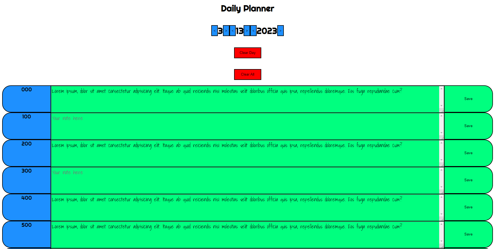

# Daily Planner

## Description

This is a template for making a daily planner, with the ability to change the date and save inputs into local storage for later. Clear day and clear all buttons for the local storage is added for resetting the daily planner. The elements for the time and the input containers as well as the save button are dynamically generated onto the html. Once there is data in the local storage changing the month day or year will either reset the input container elements or display the saved values from local storage.

### Screenshots

### Deployed Website Link

https://algorithmnblues92.github.io/dailyplanner/